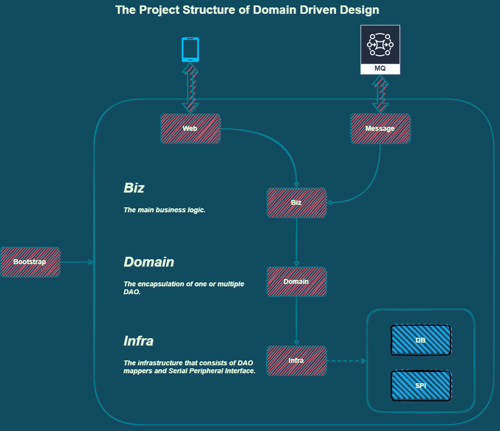

[](https://github.com/johnnymillergh/muscle-and-fitness-server/releases)
[](https://travis-ci.com/johnnymillergh/muscle-and-fitness-server)
[](https://github.com/johnnymillergh/muscle-and-fitness-server/issues)
[](https://github.com/johnnymillergh/muscle-and-fitness-server/network)
[](https://github.com/johnnymillergh/muscle-and-fitness-server)
[](https://github.com/johnnymillergh/muscle-and-fitness-server/blob/master/LICENSE)
[](https://github.com/johnnymillergh/muscle-and-fitness-server)
[](https://github.com/johnnymillergh/muscle-and-fitness-server)
[](https://twitter.com/intent/tweet?text=Wow:&url=https%3A%2F%2Fgithub.com%2Fjohnnymillergh%2Fmuscle-and-fitness-server)

# Muscle and Fitness Server

**Muscle and Fitness Server** a Spring Cloud microservice based, DDD structured, back-end server for managing data of muscle and fitness.

[Official Docker Image](https://hub.docker.com/u/ijohnnymiller)

## Features

Here is the highlights of **Muscle and Fitness Server**:

1. Each microservice is organized by [Domain Driven Design](https://en.wikipedia.org/wiki/Domain-driven_design) (DDD) structure.

1. Based on Java - [](https://github.com/adoptium/temurin17-binaries/releases/tag/jdk-17.0.4%2B8) and Kotlin - [](https://github.com/JetBrains/kotlin/releases/tag/v1.6.21), built by Gradle multi-module management [](https://github.com/gradle/gradle/releases/tag/v7.5.1). Inherited from the most modern and newest Spring frameworks:

   `org.springframework.boot:spring-boot-starter-parent` - [](https://maven-badges.herokuapp.com/maven-central/org.springframework.boot/spring-boot-starter-parent/)
   `org.springframework.cloud:spring-cloud-dependencies` - [](https://maven-badges.herokuapp.com/maven-central/org.springframework.cloud/spring-cloud-dependencies/)

2. [Spring Cloud](https://spring.io/projects/spring-cloud) Feature:

   - [Consul](https://www.consul.io/) - Service registration and discovery.
   - [Spring Cloud Gateway](https://spring.io/projects/spring-cloud-gateway) - API Gateway on top of Spring WebFlux.  Provide a simple, yet effective way to route to APIs and provide cross cutting concerns to them such as: security, monitoring/metrics, and resiliency.
   - [Spring Cloud OpenFeign](https://spring.io/projects/spring-cloud-openfeign) - Declarative REST Client: Feign creates a dynamic implementation of an interface decorated with JAX-RS or Spring MVC annotations. Enhanced connection by Okhttp 3.
   - [Spring Boot Admin](https://codecentric.github.io/spring-boot-admin/current/) - Admin UI for administration of spring boot applications.
   - [Zipkin](https://zipkin.io/) - a distributed tracing system. It helps gather timing data needed to troubleshoot latency problems in service architectures.

3. Customized Spring Cloud Starter for traditional Spring MVC and Reactive Spring WebFlux microservice. Encapsulated a bunch of libraries and dependencies. Developer can import those dependencies by demand.

   - For Spring MVC, [spring-cloud-starter](https://github.com/johnnymillergh/muscle-and-fitness-server/tree/master/spring-cloud-starter)
   - For Spring WebFlux, [reactive-spring-cloud-starter](https://github.com/johnnymillergh/muscle-and-fitness-server/tree/master/reactive-spring-cloud-starter)

5. Advocate 𝛌 Java Functional Programming, provide developers with powerful and useful functions to make Java more sweeter.

6. Secured API. [RBAC](https://en.wikipedia.org/wiki/Role-based_access_control) by API gateway and Auth Center. JWT authentication, and RBAC authorization.

8. [MySQL Replication for High Availability](https://severalnines.com/resources/database-management-tutorials/mysql-replication-high-availability-tutorial). ShardingSphere as database access middleware to boost the database capacity better.

   - Multi data source managed by ShardingSphere, including main, replica and Quartz 3 data sources.

   - [Dynamic SQL read-write isolation](https://shardingsphere.apache.org/document/current/en/features/readwrite-splitting/) and [table sharding](https://shardingsphere.apache.org/document/current/en/features/sharding/concept/table/) provided by [ShardingSphere](https://shardingsphere.apache.org/).

   - [MyBatis-Plus](https://github.com/baomidou/mybatis-plus) is the integrated ORM library.

   - [光 HikariCP](https://github.com/brettwooldridge/HikariCP) is the database connection pool.

   - TODO: Dynamically enhance connection pool size by CPU count (logical processor count). Read more at [How to Find the Optimal Database Connection Pool Size](https://wiki.postgresql.org/wiki/Number_Of_Database_Connections#How_to_Find_the_Optimal_Database_Connection_Pool_Size), [Sizing the Connection Pool](https://dev.mysql.com/doc/connector-j/5.1/en/connector-j-usagenotes-j2ee-concepts-connection-pooling.html#idm46216069663472).

8. Redis 6.x support. [Master-slave replication for high availability](https://redis.io/topics/replication). Redis cluster.

9. Docker, [Rancher](https://github.com/rancher/rancher/releases/tag/v2.5.9) Kubernetes support. [Google JIB](https://github.com/GoogleContainerTools/jib/tree/master/jib-maven-plugin) for building production-ready Docker container images.

10. OSS service, based on [Minio](https://min.io/) and SFTP integration. Asynchronous [Progressive Download](https://www.nginx.com/resources/glossary/progressive-download/) resources. Chunked resource upload. The media player will play back that content using sequential byte-range requests. Refers to [a request for partial content](https://developer.mozilla.org/en-US/docs/Web/HTTP/Range_requests) (HTTP 206). This type of request is typically used to retrieve a large asset in smaller segments. This technique is employed by HTTP Progressive Download to avoid long buffering times.

11. [STOMP over WebSocket](https://www.toptal.com/java/stomp-spring-boot-websocket) (SockJS), real time messaging, based on [RabbitMQ STOMP](https://www.rabbitmq.com/stomp.html) message broker.

12. Messaging with [RabbitMQ](https://spring.io/guides/gs/messaging-rabbitmq/), also supports [delayed message](https://blog.rabbitmq.com/posts/2015/04/scheduling-messages-with-rabbitmq), provided by [RabbitMQ Delayed Message Plugin](https://github.com/rabbitmq/rabbitmq-delayed-message-exchange/)

13. [Quartz](http://www.quartz-scheduler.org/) support. Distributed job scheduling, based on JDBC. Dynamic Quartz job configuration, served by served by database configuration table `quartz_job_configuration`. Reduce lots of Quartz job and trigger boilerplate codes.

14. Multi-environment support.

15. [Knife4j](https://doc.xiaominfo.com/) API visualization. Enhanced Swagger API documentation.

16. [Async log output](https://examples.javacodegeeks.com/enterprise-java/logback/logback-ayncappender-example/). Log file compressed by standard GNU zip ([gzip](https://en.wikipedia.org/wiki/Gzip)) compression algorithm. [ELK](https://www.elastic.co/what-is/elk-stack) log aggregation.

16. ~~PMD code quality check for each every CI (during Maven verify phase), with [Alibaba-p3c](https://github.com/alibaba/p3c) rulesets.~~

16. [JaCoCo](https://github.com/jacoco/jacoco) for JUnit code coverage.

17. JVM log configuration for JVM garbage collection.

18. AOP based request log, configurable for turning on or off.

19. Customized method argument validation.

    - [Date time range validator](https://github.com/johnnymillergh/muscle-and-fitness-server/blob/master/spring-cloud-starter/src/main/java/com/jmsoftware/maf/springcloudstarter/validation/validator/DateTimeRangeValidator.java)
    - [Enum value validator](https://github.com/johnnymillergh/muscle-and-fitness-server/blob/master/spring-cloud-starter/src/main/java/com/jmsoftware/maf/springcloudstarter/validation/validator/EnumValueValidator.java)

20. Docker container log persistence, [Size and time based rolling policy](http://logback.qos.ch/manual/appenders.html#SizeAndTimeBasedRollingPolicy). Daily rollover (at midnight 12 am) with automatic GZIP compression of the archived files.

21. [Startup and deployment statistics](https://github.com/johnnymillergh/muscle-and-fitness-server/blob/master/spring-cloud-starter/src/main/java/com/jmsoftware/maf/springcloudstarter/helper/SpringBootStartupHelper.java).

23. Customized startup banner.

## Architecture



## Usage

1. Clone or download this project.

   ```shell
   $ git clone https://github.com/johnnymillergh/muscle-and-fitness-server.git
   ```

2. Build with newest IntelliJ IDEA.

3. Click the green triangle to Run.

## Useful Commands

### Gradle

1. Compilation:

   ```shell
   $ gradle classes testClasses
   ```

1. Execute unit tests, see also [Difference Between Gradle Test and Check](https://www.baeldung.com/gradle-test-vs-check#test-task):

   ```shell
   $ gradle test
   ```

1. Build artifacts:

   ```shell
   $ gradle clean build
   ```

1. Build and push Docker images:

   ```shell
   $ gradle clean build jib
   ```

### ~~Maven (deprecated)~~

1. Compile:

   ```shell
   $ mvn clean validate compile --batch-mode --show-version --quiet -f pom.xml
   ```

2. Package:

   ```shell
   $ mvn clean package -Djunit.jupiter.execution.parallel.enabled=true --batch-mode --show-version --quiet -f pom.xml
   ```

3. Set Version:

   ```sh
   $ mvn versions:set -DgenerateBackupPoms=false -f pom.xml
   ```

4. Build Docker Images:

   ```shell
   $ mvn clean verify --batch-mode --show-version --quiet -f pom.xml
   ```

### Conventional Changelog CLI

1. Install global dependencies (optional if installed):

   ```sh
   $ npm install -g conventional-changelog-cli
   ```

2. This will *not* overwrite any previous changelogs. The above generates a changelog based on commits since the last semver tag that matches the pattern of "Feature", "Fix", "Performance Improvement" or "Breaking Changes".

   ```sh
   $ conventional-changelog -p angular -i CHANGELOG.md -s
   ```

3. If this is your first time using this tool and you want to generate all previous changelogs, you could do:

   ```sh
   $ conventional-changelog -p angular -i CHANGELOG.md -s -r 0
   ```

## 𝛌 Example

1. Require the expression to be true, otherwise throws an exception (if provided).

   ```kotlin
   import com.jmsoftware.maf.springcloudstarter.function.*
   
   requireTrue(1 != 1) { anotherBoolean: Boolean? -> log.info("aBoolean = $anotherBoolean") }
       .orElseThrow { IllegalArgumentException("aBoolean is expected to be true") }
   ```

   ```java
   import static com.jmsoftware.maf.springcloudstarter.function.BooleanCheck.requireTrue;
   
   requireTrue(1 != 1, anotherBoolean -> log.info("aBoolean = {}", anotherBoolean))
       .orElseThrow(() -> new IllegalArgumentException("aBoolean is expected to be true"));
   ```

2. Make Function have cache ability.

   ```kotlin
   val cacheMap = mutableMapOf("key1" to "1", "key2" to "2")
   val stringProcess = Function { input: String ->
       log.info("No cache return value found. input: $input Re-calculating…")
       StrUtil.subSuf(input, 3)
   }
   val result1 = cacheFunction(stringProcess, "key1", cacheMap)
   val result2 = cacheFunction(stringProcess, "key2", cacheMap)
   val result3 = cacheFunction(stringProcess, "key3", cacheMap)
   assertEquals("1", result1)
   assertEquals("2", result2)
   assertEquals("3", result3)
   assertEquals(3, cacheMap.size)
   ```

   ```java
   val cacheMap = Maps.<String, String>newHashMap();
   cacheMap.put("key1", "1");
   cacheMap.put("key2", "2");
   final Function<String, String> stringProcess = input -> {
       log.info("No cache return value found. input: {} Re-calculating…", input);
       return StrUtil.subSuf(input, 3);
   };
   val result1 = cacheFunction(stringProcess, "key1", cacheMap);
   val result2 = cacheFunction(stringProcess, "key2", cacheMap);
   val result3 = cacheFunction(stringProcess, "key3", cacheMap);
   assertEquals("1", result1);
   assertEquals("2", result2);
   assertEquals("3", result3);
   assertEquals(3, cacheMap.size);
   ```


## CI (Continuous Integration)

- [GitHub Actions](https://github.com/johnnymillergh/media-streaming/actions) is for building and publishing Docker images, also checking dependency updates and tests.
- ~~[Travis CI](https://travis-ci.com/github/johnnymillergh/media-streaming) is for publishing Docker Hub images of SNAPSHOT and RELEASE.~~

## Maintainers

[@johnnymillergh](https://github.com/johnnymillergh).

## Contributing

Feel free to dive in! [Open an issue](https://github.com/johnnymillergh/spring-cloud-tutorial/issues/new).

### Contributors

This project exists thanks to all the people who contribute. 

- Johnny Miller [[@johnnymillergh](https://github.com/johnnymillergh)]
- …


### Sponsors

Support this project by becoming a sponsor. Your logo will show up here with a link to your website. [[Become a sponsor](https://become-a-sponsor.org)]

## License

[Apache License](https://github.com/johnnymillergh/exrx-net-crawler-server/blob/master/LICENSE) © Johnny Miller

2020 - Present

